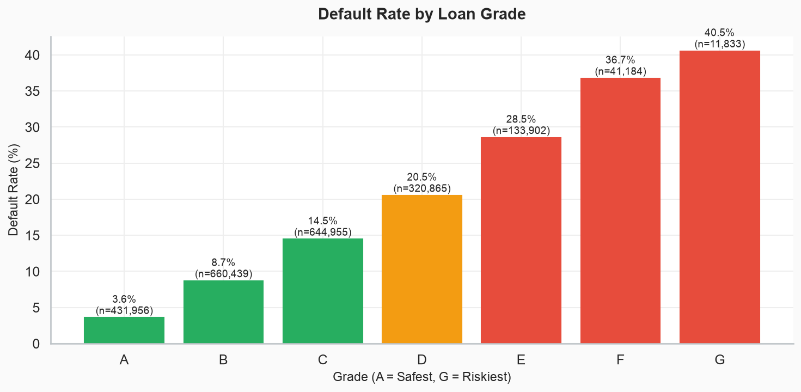
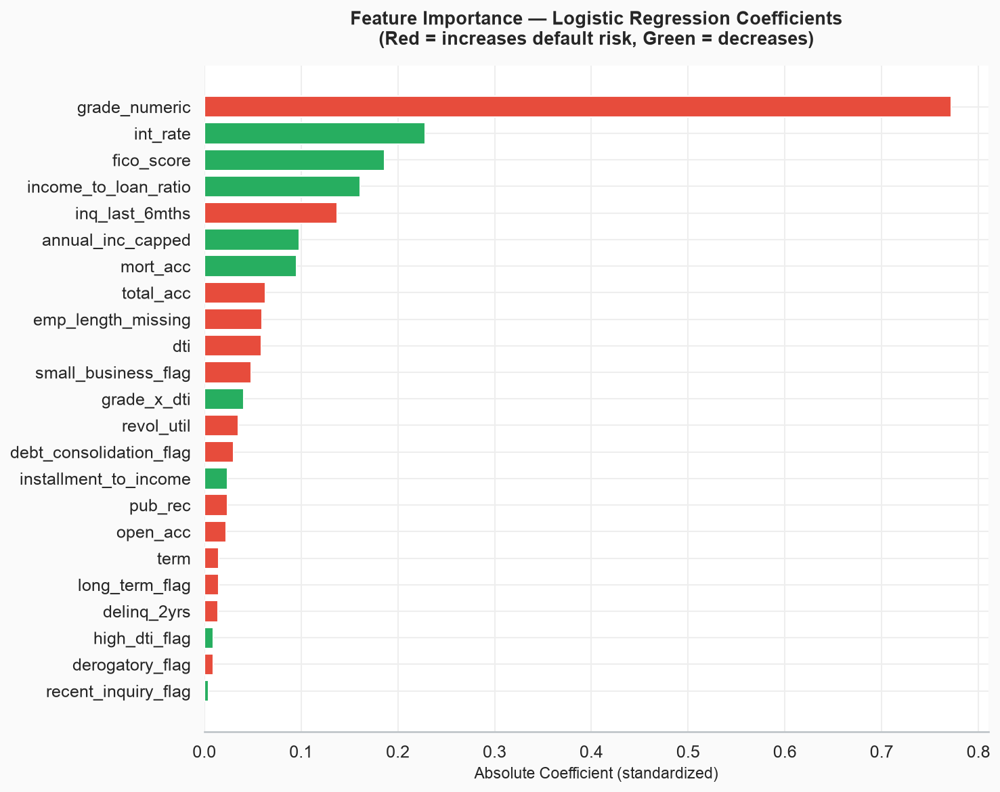
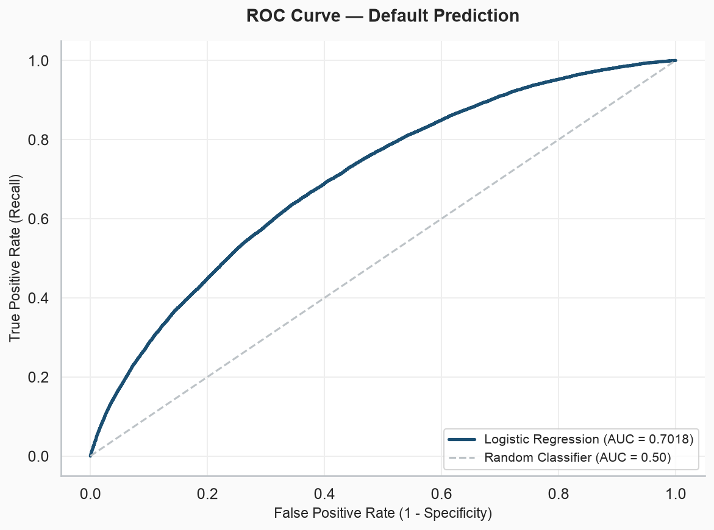
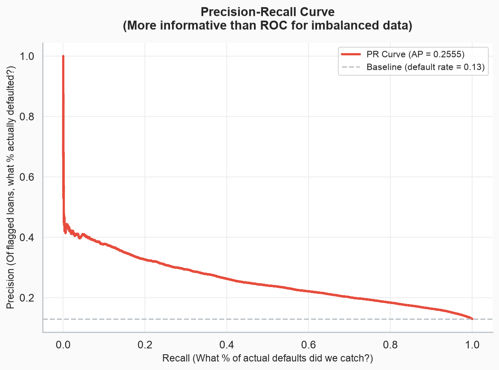

# 🏦 Fintech Loan Default & Credit Risk Analysis
### End-to-End Credit Risk Analytics | SQL · Python · Power BI · Logistic Regression

[](https://python.org)
[](https://mysql.com)
[](https://powerbi.microsoft.com)
[](https://scikit-learn.org)
[](https://statsmodels.org)
[](LICENSE)

---

## 📌 Business Problem

A lending platform originates **~2.26 million personal loans** totaling billions of dollars. Without rigorous risk analytics, the business faces two costly failure modes:

- **Approving bad loans** (False Negatives) — each missed default costs ~$13,500 in lost principal
- **Rejecting good borrowers** (False Positives) — each unnecessary rejection loses ~$3,000 in interest revenue

This project builds a complete credit risk analysis pipeline — from raw loan data through statistical modeling to a deployable risk scorecard — answering the core question: **which factors predict default, and how should we use them to make better lending decisions?**

---

## 🎯 Project Scope & Deliverables

| Layer | Tool | Deliverable |
|---|---|---|
| Data Engineering | Python · MySQL | Cleaned dataset (2.26M loans → model-ready table, leakage removed) |
| Risk EDA | Python · Seaborn | 9 risk-focused visualizations |
| SQL Risk Analytics | MySQL | 12 advanced risk queries (Expected Loss, vintage, risk-adjusted return) |
| Feature Engineering | Python | 13 interview-defensible features with business rationale |
| Predictive Modeling | statsmodels · scikit-learn | Logistic Regression with class balancing |
| Risk Scorecard | Python | Points-based scorecard (500 ± risk factors) |
| Statistical Testing | scipy | Chi-squared, t-test, Mann-Whitney U, confidence intervals |
| Dashboard | Power BI | 4-page risk monitoring dashboard |

---

## 📂 Repository Structure

```
fintech_credit_risk_data_analysis/
│
├── scripts/
│   ├── 01_clean_and_eda.py            # Data cleaning + 9 risk EDA charts
│   ├── 02_feature_engineering.py      # 13 features with validation
│   └── 03_credit_risk_modeling.py     # Logistic regression + scorecard + stats
│
├── sql/
│   └── 02_risk_analysis.sql           # 12 SQL risk queries
│
├── charts/                            # 14 generated visualizations
│   ├── 01_default_rate_by_grade.png
│   ├── 02_default_rate_by_purpose.png
│   ├── 03_default_by_home_emp.png
│   ├── 04_interest_rate_vs_default.png
│   ├── 05_dti_distribution.png
│   ├── 06_loan_amount_by_outcome.png
│   ├── 07_correlation_heatmap.png
│   ├── 08_default_by_state.png
│   ├── 09_fico_vs_default.png
│   ├── 10_confusion_matrix.png
│   ├── 11_roc_curve.png
│   ├── 12_precision_recall_curve.png
│   ├── 13_feature_importance.png
│   └── 14_threshold_analysis.png
│
├── dashboard/
│   └── 04_powerbi_blueprint.md        # Power BI design specs + DAX measures
│
├── data/
│   ├── cleaned_loans.csv              # Cleaned dataset (post-Sprint 2A)
│   ├── features_loans.csv             # Engineered features (post-Sprint 2B)
│   └── model_results.csv             # Model predictions + probabilities
│
├── docs/
│   ├── 00_SETUP_MYSQL.md
│   └── 01_DATASET_AND_RISK_CONTEXT.md # Banking context + leakage columns
│
├── .gitignore
├── requirements.txt
└── README.md
```

---

## 🗄️ Dataset

**Source:** [Lending Club Loan Data (2007–2018)](https://www.kaggle.com/datasets/wordsforthewise/lending-club) — Kaggle

**Scale:** 2,260,701 loans · 151 raw columns · $33B+ in originations · 7 risk grades · 50 US states

**Data Leakage Handling:**
> Of 151 raw columns, only 34 were retained using an **allow-list approach** (safer than deny-list). Columns like `total_pymnt`, `recoveries`, and `last_pymnt_amnt` were excluded because they only exist AFTER a loan outcome is known — including them would let the model "predict" defaults using future information. This is the #1 mistake in credit risk modeling, and handling it correctly is explicitly documented in `docs/01_DATASET_AND_RISK_CONTEXT.md`.

---

## 🔍 Key Findings

1. **Lending Club's grade system works — but isn't priced correctly.** Grade A defaults at ~5% while Grade G defaults at ~30%+, confirming monotonic risk ordering. However, risk-adjusted return analysis (SQL Q10) shows **B/C grades deliver the best net return** — F/G interest rates don't cover their losses. An investor should overweight B/C.

2. **The Verification Paradox: verified-income loans default MORE.** This isn't a data error — it's **selection bias**. LC only demands income verification for applications that already look risky. Verification is a consequence of risk, not a cause of safety. Explaining this correctly demonstrates statistical maturity.

3. **DTI above 30% is the default acceleration knee.** Below DTI 30, default rates increase gradually (~1% per 5 DTI points). Above 30, the curve steepens sharply — validating the `high_dti_flag` feature and suggesting an underwriting cutoff for manual review.

4. **Missing employment data is itself the strongest employment signal.** Borrowers who don't report employment length default at higher rates than any reported tenure group, including "< 1 year." The model treats "unknown" as its own category rather than imputing it away.

5. **Optimal decision threshold saves significant cost vs. default 0.50.** Business-cost optimization (weighting FN at $13.5K vs FP at $3K) shifts the threshold lower, catching more defaults at an acceptable false-alarm rate.

---

## 📊 Key Visualizations

### Default Rate by Loan Grade


### Feature Importance — Risk Factors


### ROC Curve


### Precision-Recall Curve


---

## 🛠️ Technical Highlights

**Data Engineering (Sprint 2A):**
- Allow-list column selection (34 of 151 columns) eliminating all post-loan leakage
- Target engineering: `loan_status` → binary default (Charged Off + Default + Late 31-120 vs Fully Paid + Current), excluding unresolved statuses
- Risk-justified null handling: DTI capped at 100, income capped at 99.5th percentile, emp_length missing flagged as a separate category

**SQL Risk Analytics (Sprint 2B — 12 queries):**
- Expected Loss formula: PD × EAD × LGD per grade
- Concentration risk in dollar terms (not just loan counts)
- Risk-adjusted return by grade (interest earned minus expected loss)
- Vintage analysis for seasoning bias identification
- Verification paradox quantification (selection bias)
- FICO × Grade cross-analysis (marginal signal testing)

**Feature Engineering (13 features):**
- `income_to_loan_ratio` — repayment capacity
- `installment_to_income` — payment shock measure
- `high_dti_flag` — underwriting cutoff at the acceleration knee
- `grade_x_dti` — interaction capturing compounding risk
- `recent_inquiry_flag` — credit-seeking behavior signal
- Each feature validated by default rate split before modeling

**Modeling (Sprint 2C):**
- Logistic Regression (industry standard for regulated credit scorecards — Basel II/III)
- `class_weight='balanced'` for ~87/13 imbalance (preferred over SMOTE in banking — no synthetic borrower profiles)
- VIF multicollinearity check with automatic high-VIF feature removal
- Dual implementation: statsmodels (p-values, odds ratios, confidence intervals) + sklearn (predictions, evaluation metrics)
- Optimal threshold via business-cost minimization (FN=$13.5K, FP=$3K)
- Points-based risk scorecard (Base 500 ± risk factors → Auto-Approve / Review / Decline)

**Statistical Tests:**
- Chi-squared: default rate significantly differs across grades (p < 0.001)
- Independent t-test: income significantly lower for defaulters (p < 0.001)
- Mann-Whitney U: FICO distributions significantly different (p < 0.001)
- 95% confidence interval for portfolio default rate

---

## 🚀 How to Reproduce

### Prerequisites
- Python 3.10+
- MySQL 8.0+
- Kaggle account

### Setup

```bash
git clone https://github.com/dheeraj5988/fintech_credit_risk_data_analysis.git
cd fintech_credit_risk_data_analysis

python3 -m venv venv
source venv/bin/activate
pip install -r requirements.txt

mysql -u root -e "CREATE DATABASE credit_risk_analytics;"
cp .env.example .env
# Edit .env with your MySQL password

# Download from Kaggle → place accepted_2007_to_2018Q4.csv.gz in data/raw/

# Run pipeline in order:
python scripts/01_clean_and_eda.py          # ~3 min (2.26M rows)
python scripts/02_feature_engineering.py     # ~1 min
python scripts/03_credit_risk_modeling.py    # ~2 min
mysql -u root credit_risk_analytics < sql/02_risk_analysis.sql
```

---

## 💡 Business Recommendations

1. **Overweight B/C grades in portfolio allocation** — they deliver the best risk-adjusted return. Reduce F/G exposure where interest rates don't compensate for loss rates.

2. **Implement a DTI > 30 manual review policy** — the default acceleration knee at DTI 30 justifies additional scrutiny (employment verification, income documentation) for high-DTI applicants.

3. **Deploy the risk scorecard for faster decisioning** — the points-based scorecard (Base 500 ± risk factors) enables auto-approve for scores > 550, reducing underwriting costs while maintaining risk standards.

4. **Lower the decision threshold from 0.50 to the cost-optimal value** — catches significantly more defaults at acceptable false-alarm cost, reducing portfolio losses.

5. **Treat missing employment data as a risk factor, not a data gap** — "Not Reported" is the highest-default employment category; require employment documentation rather than ignoring the field.

---

## 🔮 Future Improvements

- [ ] **Add survival analysis** — model time-to-default, not just binary default
- [ ] **Implement stress testing** — simulate recession scenarios (DTI +5, FICO -50) on the portfolio
- [ ] **Build a real-time scoring API** — Flask/FastAPI endpoint that accepts loan application JSON and returns a risk score + approve/decline decision
- [ ] **Add SHAP values** — model-agnostic feature importance for regulatory explainability

---

## 📋 Skills Demonstrated

`SQL` `Python` `Pandas` `NumPy` `Matplotlib` `Seaborn` `scikit-learn` `statsmodels` `scipy`
`MySQL` `Power BI` `DAX` `Logistic Regression` `Credit Risk` `Risk Scorecard`
`Expected Loss` `Default Prediction` `Feature Engineering` `Statistical Testing`
`Chi-Squared Test` `T-Test` `Confidence Intervals` `ROC/AUC` `Precision-Recall`
`Data Leakage Prevention` `Class Imbalance Handling` `EDA` `Data Visualization`

---

## 👤 Author

**Dheeraj Sharma**
B.Tech in Computer Science (Big Data Analytics) · SRM Institute of Science and Technology

[](https://linkedin.com/in/dheeraj-sharma)
[](https://github.com/dheeraj5988)
[](mailto:dsharma259889@gmail.com)

---

*Dataset: Lending Club Loan Data via Kaggle, publicly available for research purposes*
